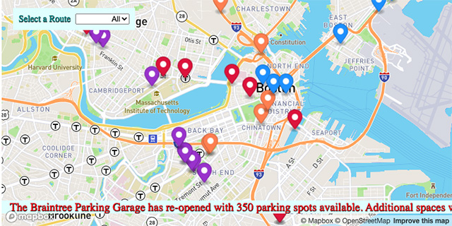

# Real Time Bus Tracker With Javascript ES6

This code provides real time information for four Boston bus lines. This code originate from an assignment in Week #8 of MIT's MERN Coding Bootcamp. The challenge was to animate and add features to a map view of a Boston bus route.

<h2>API Links</h2>
<ul>
  <li> <a href="https://api-v3.mbta.com/">Massachusetts Bay Transportation Authority (MBTA)</a></li>
<li><a href="https://www.mapbox.com/maps">MapBox</a></li>
</ul>
<h2>Features</h2>
<ol>
<li>A selector switch between the views between four different bus routes</li>
<li>Pop up messages with bus information added to each bus marker. (Clicking on the marker opens mesage box)</li>
<li>Custom colors were added to differentiate each bus route</li>
<li>Added an Alert banner towards bottom of Map for messages</li>
</ol>
<h2>How to Use</h2>
<ol>
<li>Fork a Copy of this project to your Github page</li>
<li>Clone a copy from your Github page to your local work environment</li>
<li>Create an account at MapBox using this link <a href="https://www.mapbox.com/maps">MapBox</a> </li>
<li>use this link to open an account or retrieve a token there to use without an account<a href="https://api-v3.mbta.com/">Massachusetts Bay Transportation Authority (MBTA)</a></li>
<li>Past your two keys in the proper locations in the script file</li>
<li>Open the index file using a browser</li>
<li>Select from one of four routes from the selectormenu on the top left side of the web page</li>
 <li>Watch the alerts and markers change in real time</li>
</ol>
<h2>Roadmap</h2>

Exploring ideas for additional features such as the ability to choose additional routes and map controls

<h2>Contributors</h2>
<ul>
  <li>Bill Conley</li>
  <li>Dr. Abel Sanchez</li>
 </ul>
<h2>License</h2>
  
MIT License

  
Copyright (c) 2021 Bill Conley

  
Permission is hereby granted, free of charge, to any person obtaining a copy
of this software and associated documentation files (the "Software"), to deal
in the Software without restriction, including without limitation the rights
to use, copy, modify, merge, publish, distribute, sublicense, and/or sell
copies of the Software, and to permit persons to whom the Software is
furnished to do so, subject to the following conditions:

  
The above copyright notice and this permission notice shall be included in all
copies or substantial portions of the Software.

  
THE SOFTWARE IS PROVIDED "AS IS", WITHOUT WARRANTY OF ANY KIND, EXPRESS OR
IMPLIED, INCLUDING BUT NOT LIMITED TO THE WARRANTIES OF MERCHANTABILITY,
FITNESS FOR A PARTICULAR PURPOSE AND NON-INFRINGEMENT. IN NO EVENT SHALL THE
AUTHORS OR COPYRIGHT HOLDERS BE LIABLE FOR ANY CLAIM, DAMAGES OR OTHER
LIABILITY, WHETHER IN AN ACTION OF CONTRACT, TORT OR OTHERWISE, ARISING FROM,
OUT OF OR IN CONNECTION WITH THE SOFTWARE OR THE USE OR OTHER DEALINGS IN THE
SOFTWARE.

